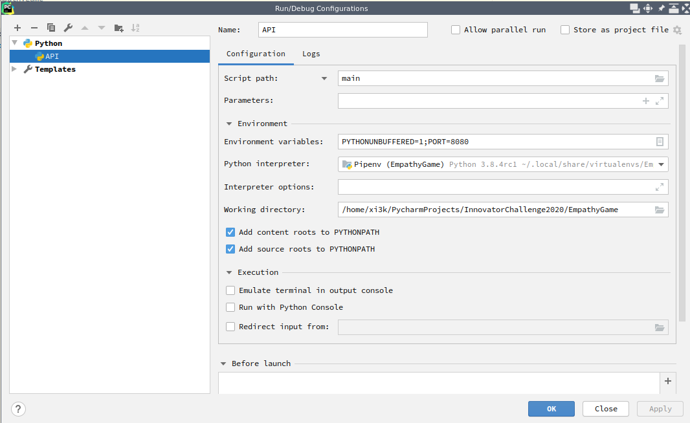

# Deployment to SAP Cloud Platform

## One-time preparation
1. Install [Cloud Foundry CLI](https://github.com/cloudfoundry/cli#downloads).
2. Install [MultiApps CLI plugin for CF](https://github.com/cloudfoundry-incubator/multiapps-cli-plugin).
4. Install [Cloud MTA Build Tool](https://sap.github.io/cloud-mta-build-tool/download/).
3. Log on to our Cloud Foundry Environment through the CLI [Source](https://help.sap.com/viewer/65de2977205c403bbc107264b8eccf4b/Cloud/en-US/7a37d66c2e7d401db4980db0cd74aa6b.html):
	* `cf login`
	* API endpoint: https://api.cf.eu10.hana.ondemand.com  (taken from our Subaccount overview page)
	* Email: `<your SAP mail address>`
	* Password: `<your SSO SAP password>`
	
## Compound deployment
**Note**: Does not yet work. It seems as the MTA build tool currently does not have a Python builder.
4. **Note**: Only do this, if the GitHub repo here does not already contain a `requirements.txt`. Create a `requirements.txt` from the `Pipfile` through `pipenv run pip freeze > requirements.txt`.
4. Download all the requirements to a `vendor` folder through `pip download -d vendor -r requirements.txt --platform manylinux1_x86_64 --only-binary=:all:`
    **Note**: The `requirements.txt` above might contain unrequired dependencies that lead to errors when downloading. Those dependencies can be removed with no harm.
5. Create the `mtar` file by executing `mbt build`.
6. Deploy the `mtar` file to HCP through `cf deploy mta_archives/...mtar`.

## API deployment

1. **Note**: Only do this, if the GitHub repo here does not already contain a `requirements.txt`. Create a `requirements.txt` from the `Pipfile` through `pipenv run pip freeze > requirements.txt`.
2. Download all the requirements to a `vendor` folder through `pip download -d vendor -r requirements.txt --platform manylinux1_x86_64 --only-binary=:all:`
    **Note**: The `requirements.txt` above might contain unrequired dependencies that lead to errors when downloading. Those dependencies can be removed with no harm.
3. Run `cf push` which uses the `manifest.yml`, `runtime.txt` and the `requirements.txt`.

## UI deployment

5. Create the `mtar` file by executing `mbt build`.
6. Deploy the `mtar` file to HCP through `cf deploy mta_archives/...mtar`.

# Local development

If you are developing on a Windows machine and have installed all dependencies, please use script `run_windows_local.ps1` to start you local development environment.

## Service layer (Python API backend)

1. Create new Python project with your favourite IDE.
2. Use _Pipenv_ for dependency management.
3. Clone the Github repo https://github.com/simachri/empathygame.
4. Run `pipenv install` to install the dependencies locally.
5. If you are using Windows and for example Powershell you need to set the environment variable:
```
# Set environment variable
$Env:PORT = "8080"

# Start python server
py ./api/main.py
```
6. This is an example launch configuration from PyCharm:


## UI layer

For the first time, add `@sap` to you npm and install all dependencies:

```
# Add @sap to your npm
npm config set @sap:registry https://npm.sap.com // Only the first time
# Install all dependencies
npm install
```

After preparation you can start the application router by:

```
# Go to web folder
cd web
# Start development server
npm run dev
```

The service is reachable on localhost:3000 where the api is accessable on localhost:3000/api and the ui is accessable on localhost:3000/ui.

# Knowledge Documentation
All findings during this projects are documented. Please visit

| Topic | Documentation |
| ----- | ------------- |
| UI5   |  [UI5 Knowledge](docs/UI5_Knowledge.md) |
